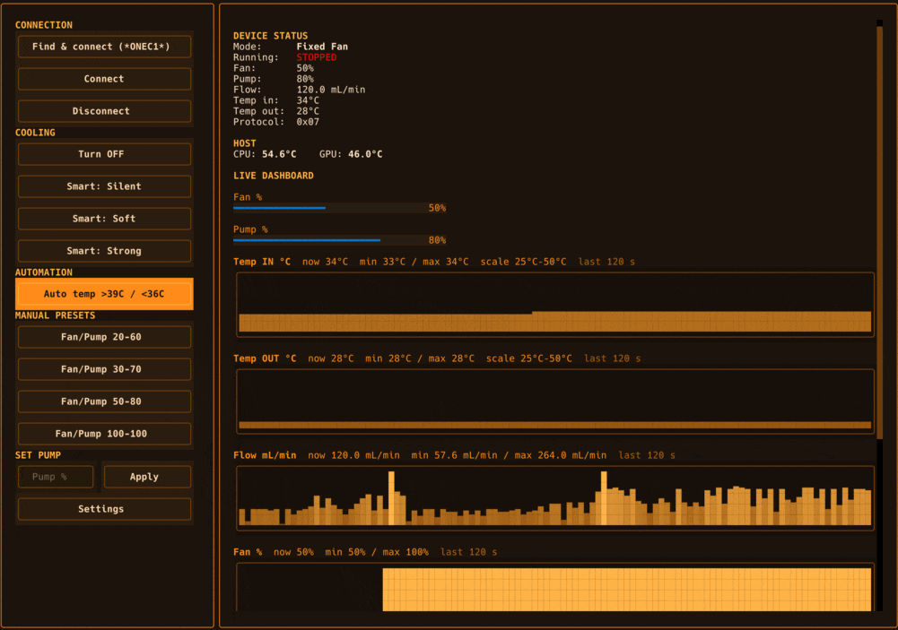

# onexFrostBay

**FrostBay liquid cooling control app for the OneXPlayer Super X**

Terminal (TUI) application to test and control the **FrostBay** liquid
cooling system of the **OneXPlayer Super X**, the BLE device
described in [`specification.md`](specification.md).

Built with [Textual](https://github.com/Textualize/textual) and styled with an
orange theme (rounded orange borders, orange gauges and sparklines). It
connects over Bluetooth Low Energy (service `FFE0`, characteristic `FFE1`),
shows the device connection status, reads the current operating parameters,
and sends control commands — all from the terminal.

Tested on **CachyOS** (Arch-based).

<p align="center">
  
</p>

## Disclaimer

This software is provided for experimental and educational use. The author
accepts no responsibility for any damage. By using this program you assume
all risks and take full responsibility yourself, as it may damage your main
device or the liquid cooling system. Use at your own risk.

---

## Features

- BLE scanning and connections via `bleak` (the legacy 0.4.1 protocol path),
  with retries for connection/initial-read errors
- **Automatic device discovery** by advertised name substring `ONEC1`
  (e.g. `CoolingSystem_ONEC1`). On startup the app scans for a device whose
  name contains `ONEC1` (case-insensitive) and connects to the first match.
  You can still pass `--address <MAC>` to skip discovery.
- Reads the current Frostbay state from `FFE1`:
  - mode (OFF / Smart Fan / Fixed Fan)
  - runtime running indicator (`state[12]`)
  - fan percentage
  - flow rate (mL/min, decoded from `state[6..7]`)
  - pump percentage
  - input / output water temperatures
- **Live auto-refresh**: after connecting, the device is polled automatically
  (every 1 s) and the dashboard reflects the latest parameters without manual
  refresh; the `r` hotkey refreshes on demand.
- **Live dashboard with graphs**: a rolling real-time view of temperatures,
  flow rate, fan % and pump % with unicode sparkline time-series (fixed
  scales for Temp IN/OUT, auto-scale for Flow/Fan/Pump, current/min/max
  labels) plus Fan/Pump progress bars.
- Sends control commands using the verified 3-chunk `1C/2C/3C` transport:
  - **Turn OFF**
  - **Smart Fan**: `silent`, `soft`, `strong` presets
  - **Manual settings**: a preset list of fixed fan/pump pairs
    (`20-60`, `30-70`, `50-80`, `100-100`)
  - **Set pump** to an explicit value
- **Auto-restart on stop** (switch): when the pump stops on its own while
  the device is in an active mode (Smart or Fixed), the app re-applies that
  mode's settings to wake it back up. To avoid disrupting a fresh start it
  only reacts to a real running→stopped transition and stays silent for a
  short startup grace window (~10 s) after any command, so the pump can
  spin up undisturbed. A deliberate OFF is never restarted. While **Auto
  temp** is enabled it takes over restarts itself, so auto-restart stays
  idle and no duplicate commands are sent.
- **Auto temp mode** (switch): watches host **CPU/GPU temperature** and
  drives the pump by up to 5 configurable temperature stages. Each stage
  has its own ON °C threshold and mode (Smart or fixed fan/pump). The
  default single-stage behavior: when the temperature goes **above 50 °C**
  and the device reports `stopped`, the app sends a start command in
  **Smart Silent** mode; when it drops **below 45 °C** the pump is turned
  **OFF**. The 45–50 °C band is a hysteresis zone (no commands), so the
  pump never flaps. The resend policy is configurable: re-send the ON
  command every 1 s, every 2 s (default, fire-and-forget, serialized — no
  queue builds up), or the legacy wait-for-stop behavior.
- **Host CPU/GPU telemetry** shown alongside device state. hwmon sensors
  are classified by chip name and read directly from `/sys/class/hwmon` as
  a fallback when `psutil` exposes nothing usable (e.g. AMD `k10temp` on
  Strix Halo / Zen 5).
- **Settings persistence**: the connected device address and the automation
  switch states (auto-restart, auto temp, BLE error log, auto-connect) are
  saved to `~/.config/frostbay/config.json` (override with
  `FROSTBAY_CONFIG`) and restored on the next launch. The thermal stage
  count, temperatures, modes and resend policy are persisted too.

## Quick start (one command)

```bash
git clone https://github.com/Kuznecoff/onexFrostBay.git
cd onexFrostBay
./run.sh
```

`run.sh` creates the virtual environment and installs dependencies on first
run, then starts the TUI. Pass-through arguments work as usual:
`./run.sh --address <MAC>`.

### CachyOS installer

`install.sh` additionally sets up the system for a desktop user:

```bash
./install.sh                # system packages + venv + apps-menu entry, asks about autostart
./install.sh --autostart    # also start Frostbay on login
./install.sh --no-autostart
```

It installs `bluez`/python packages (sudo), creates the venv, adds a
**Frostbay** entry to the applications menu (opens the TUI in your default
terminal) and can enable autostart.

## Run

```bash
# Auto-discover and connect to the device whose name contains "ONEC1"
python -m frostbay

# Or specify a known BLE address (skips discovery)
python -m frostbay --address <BLE-MAC>

# Or via the toolbox launcher
cd frostbay-toolbox
./run.sh
```

## Toolbox install scripts

The toolbox ships its own lifecycle scripts (Linux; `pacman`):

```bash
cd frostbay-toolbox

./install.sh                 # system packages + venv + launcher + apps-menu entry
./install-autostart.sh       # the above + autostart on login
./disable-autostart.sh       # disable autostart (keeps the app installed)
./uninstall.sh               # remove launcher + menu entry + autostart
./uninstall.sh --purge       # also delete the virtual environment
```

`install.sh` puts a `frostbay-toolbox` launcher in `~/.local/bin` (make sure
it is on `PATH`) and adds an applications-menu entry that opens the TUI in
your default terminal. The virtual environment is shared with the root
project launcher, so `uninstall.sh` keeps it unless you pass `--purge`.

## Install (manual)

```bash
python -m venv .venv
# Linux
source .venv/bin/activate

pip install -r requirements.txt
```

### Platform notes

- **CachyOS / Arch Linux**: `bleak` uses BlueZ over D-Bus. Install:
  ```bash
  sudo pacman -S bluez bluez-utils
  ```
  You may need to run with a Bluetooth adapter that exposes the full Frostbay
  GATT tree (see `specification.md` notes about adapter choice).

## Project layout

```
onexFrostBay/
├── specification.md          # Frostbay BLE protocol reference
├── CHANGELOG.md              # release history (Keep a Changelog)
├── requirements.txt
├── README.md
├── run.sh                    # one-command launcher (venv + deps + TUI)
├── install.sh                # CachyOS installer (packages, menu entry, autostart)
├── .gitignore
├── frostbay-toolbox/         # terminal-only Textual TUI controller
│   ├── run.sh                # launches the Textual TUI
│   ├── textual_app.py        # Textual app (orange theme, dashboard, controls)
│   ├── install.sh            # toolbox installer (packages, venv, launcher, menu)
│   ├── install-autostart.sh  # install + autostart on login
│   ├── disable-autostart.sh  # disable autostart
│   └── uninstall.sh          # remove launcher/menu/autostart (--purge venv)
└── frostbay/
    ├── __init__.py
    ├── __main__.py           # entry point for `python -m frostbay` (launches the TUI)
    ├── protocol.py           # FFE1 state blob parser + command builders
    ├── ble.py                # bleak-based cross-platform BLE client + auto-polling
    ├── config.py             # JSON settings (~/.config/frostbay/config.json)
    ├── history.py            # ring-buffer telemetry history for graphs
    ├── host.py               # host CPU/GPU temperature & load telemetry
    └── transports.py         # GATT transports (bleak / BlueZ D-Bus)
```

## Implementation notes

- GATT access goes through `BleakTransport` (`frostbay/transports.py`), the
  legacy 0.4.1 protocol path: a fresh `BleakClient` connect scoped to the
  `FFE0` primary service (BlueZ). On Linux it prefers
  an already connected + `ServicesResolved` BlueZ device exposing `FFE1`,
  preserving its adapter and avoiding an implicit scan.
- The `FFE1` characteristic is read as a 64-byte state blob and parsed per
  `specification.md`.
- Writes are never a single 64-byte write; the protocol splits the patched
  payload into three 20-byte chunks prefixed with `0x1C`, `0x2C`, `0x3C`,
  sent with ~20 ms gaps. The write mode is chosen from the characteristic's
  advertised properties at connect time: *Write With Response* when the device
  only declares `write`, otherwise *Write Without Response*. If a write fails,
  the client retries the other mode and keeps whichever worked.
- Pump speed is clamped to the supported `50..100` range; the recommended
  practical range is `80..100`.
- The **Manual settings** presets and both automation switches (auto-restart,
  auto temp) all go through the same patched-state writes as the other
  commands.
- The TUI runs on the main thread while BLE I/O runs on a background asyncio
  loop. Actions are dispatched to that loop via
  `asyncio.run_coroutine_threadsafe`. Connection attempts can take up to
  four minutes including retries; a timeout cancels the operation and waits
  for cleanup before another action runs.

## Troubleshooting

### `No powered Bluetooth adapters found`

`Auto-connect failed: 'No powered Bluetooth adapters found. Turn on Bluetooth
and try again.'` — the machine has no usable/powered Bluetooth adapter.

- Turn Bluetooth on (system menu, or `rfkill unblock bluetooth`).
- Check adapters: `bluetoothctl list` (should show at least one powered adapter;
  power it with `power on`).
- On a desktop without built-in Bluetooth, plug in a USB BLE dongle.
- The app keeps running; once the adapter is available, use **Scan** /
  **Connect** in the TUI to connect.

### `BleakGATTProtocolErrorCode.UNLIKELY_ERROR: 14` / connects then drops instantly (Linux)

ATT error `0x0E` ("Unlikely Error") reports a failed GATT operation; the
message alone does not identify whether firmware, controller/driver behavior,
or stale discovery state caused it. `Service Discovery has not been performed
yet` can follow when that session is lost. On Linux the app prefers
an already connected + `ServicesResolved` BlueZ device exposing `FFE1`
(see `frostbay/transports.py`), preserving its adapter and avoiding an
implicit scan. Bleak on Linux uses BlueZ and the same BLE/GATT protocol;
it cannot bypass a broken controller or force missing services to exist.
An existing ready session is reused; a disconnected device still requires
BlueZ connection/discovery. A successful initial state read is required
before reporting connection success.

If you still hit `0x0E`:

1. **Let the system own the session first.** Pair and connect the device in
   the desktop Bluetooth UI (GNOME/KDE) or `bluetoothctl connect <MAC>`,
   so BlueZ reports `Connected=true` + `ServicesResolved=true`. The app then
   attaches without re-triggering discovery.
2. **Consider clearing a stale bond/cache** after collecting diagnostics:
  `bluetoothctl remove <MAC>`, then scan and reconnect/re-pair. This removes
  the Linux pairing for that device. Restarting Bluetooth, if needed, affects
  all Bluetooth connections; do not remove other devices or the whole cache.
3. **Use the adapter that exposes the full GATT tree.** The built-in `hci0`
   path was observed broken (UUID list collapses to battery/HID); an external
   USB BLE adapter (`hci1`) exposes the correct Frostbay tree. Check with
   `bluetoothctl list`.
4. **Neutralize the bogus HID** (`1812`) volume-key side effect via the
   `hwdb` override in `specification.md` (does not affect the GATT path).

If the app reports a timeout waiting for a connected, services-resolved
device exposing `FFE1`, collect the actual BlueZ state while the device is
connected:

```bash
bluetoothctl list
bluetoothctl info <MAC>
busctl tree org.bluez
journalctl -b -u bluetooth --no-pager -n 100
```

Look for the FFE0 UUID and a GATT characteristic whose UUID is FFE1;
`ServicesResolved` alone is insufficient. If only a partial battery/HID
tree appears, see the adapter-specific findings in
[`specification.md`](specification.md).

### Regression tests

With dependencies installed, run from the repository root (no BLE hardware
or desktop session required):

```bash
.venv/bin/python -W error::RuntimeWarning -m unittest discover -s tests -v
```
